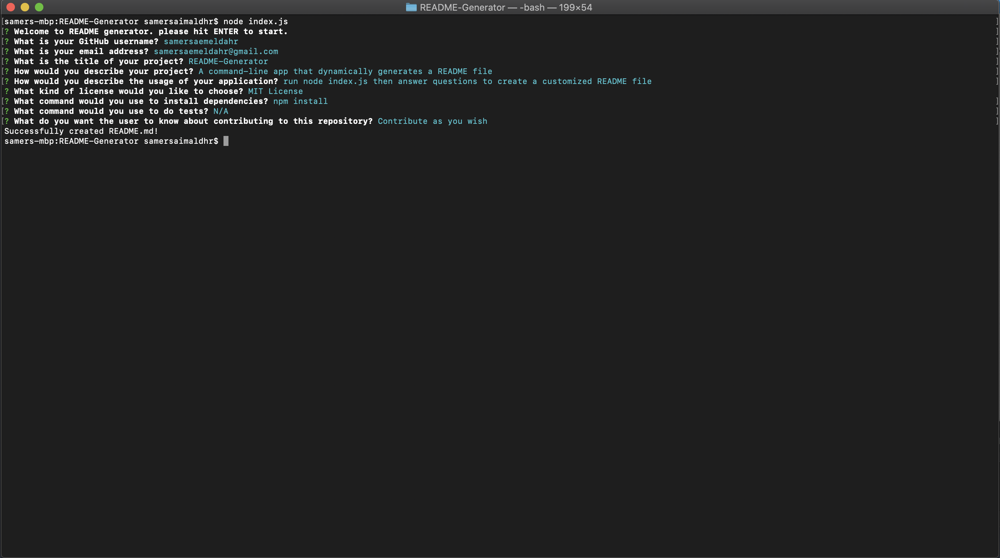
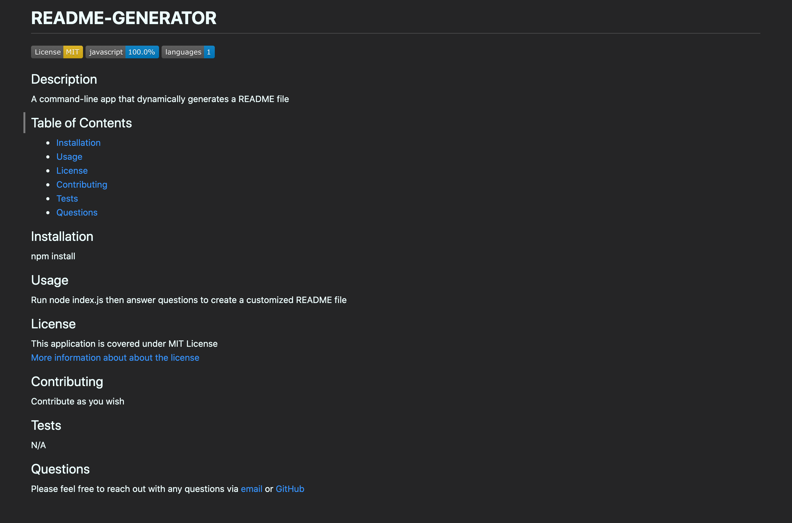

# **README GENERATOR**

  
  
  

  ## Description 
  A command-line application that generates a README file dynamically based on the user's input.

  

  

  ## Table of Contents
  
  * [Installation](#installation)
  * [Usage](#usage)
  * [License](#license) 
  * [Contributing](#contributing)
  * [Tests](#tests)
  * [Questions](#questions) 
  
  ## Installation
  1. Clone or download the repository
  1. Open console
  1. Run `npm install` to install dependencies
  
  ## Usage 
  1. Write `node index.js` in console to start the application
  1. A greeting message will appear, hit `enter` to start
  1. The user is prompted to answer several questions to create the content of the README file
  1. After answering all the questions, the app shows this message `Successfully created README.md!`
  1. The file will be created in the same root directory of the application in the generated folder

Please refer to this [video](https://drive.google.com/file/d/1L3PUFg88L-oRWQ2JoAoX8KKZgJ65XpAg/view) for an in-depth functionality of the application
  
  
## License
  
This application is covered under MIT License [More information about about the license](https://choosealicense.com/licenses/mit/)
  
  ## Contributing
  Please feel free to contribute by sending a pull request
  
  ## Tests
  N/A

  ## Questions
  Please feel free to reach out with any questions via [email](mailto:samersaemeldahr@gmail.com) or [GitHub](https://www.github.com/samersaemeldahr)

